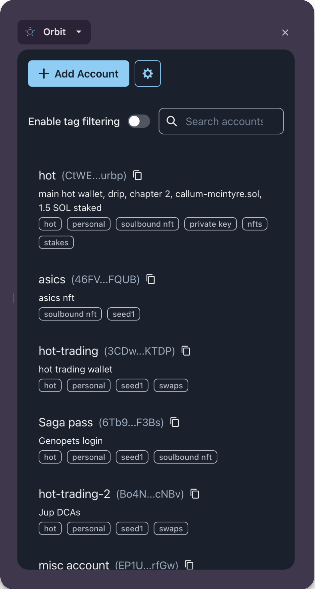
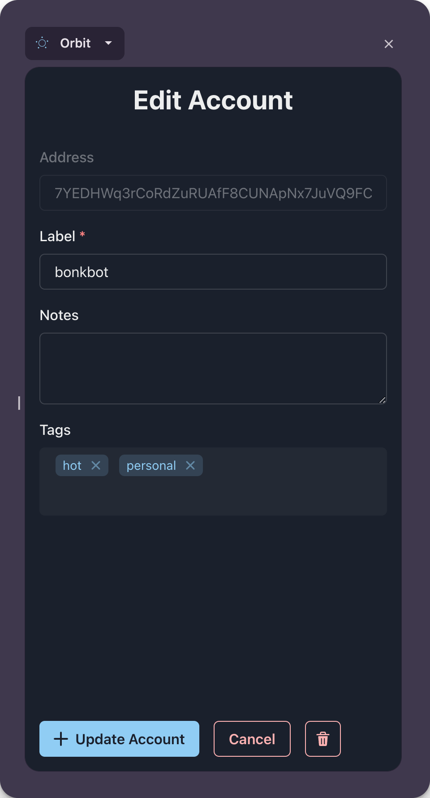
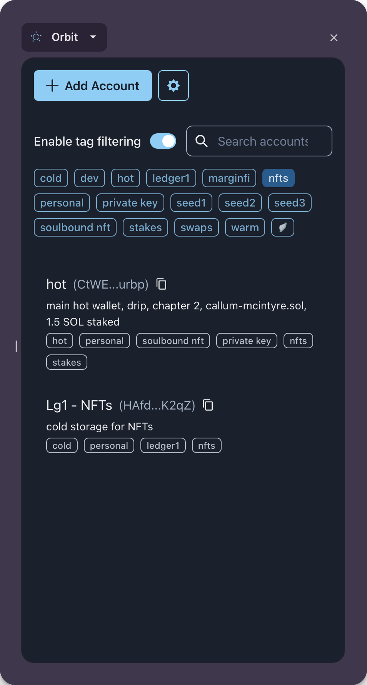
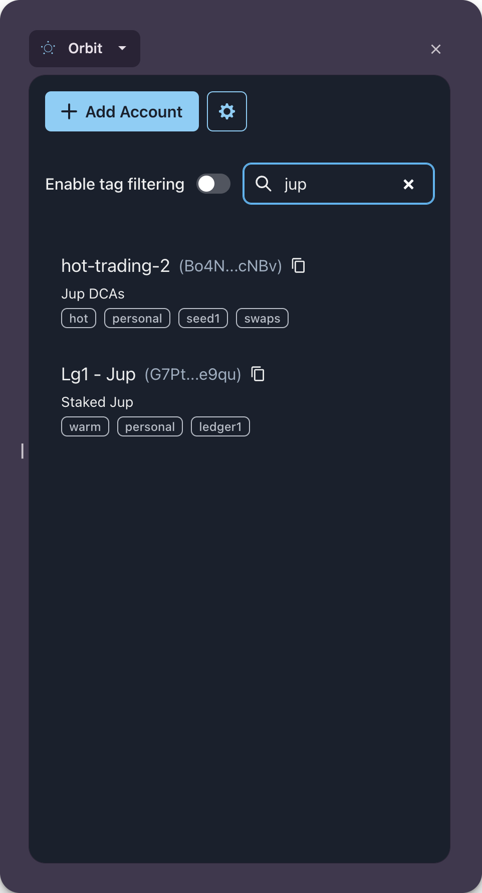
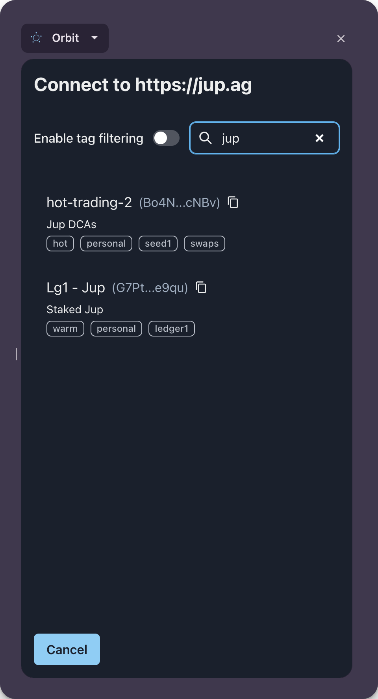
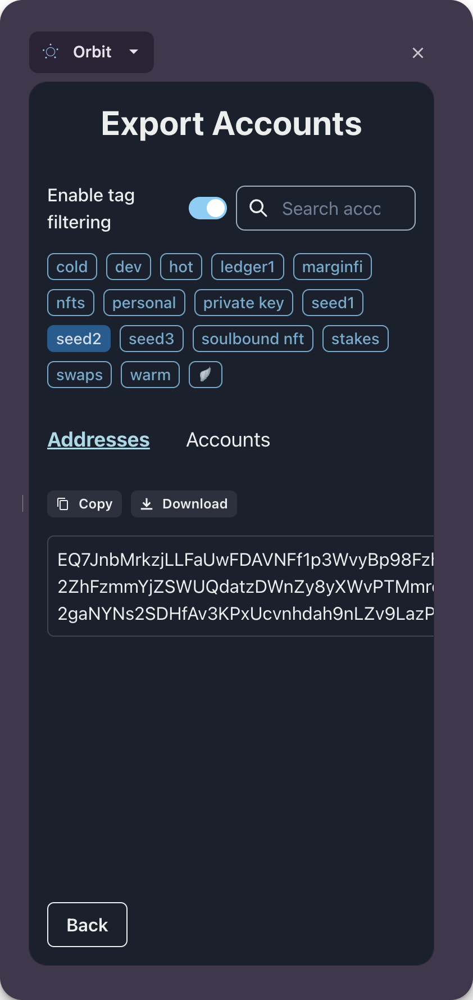
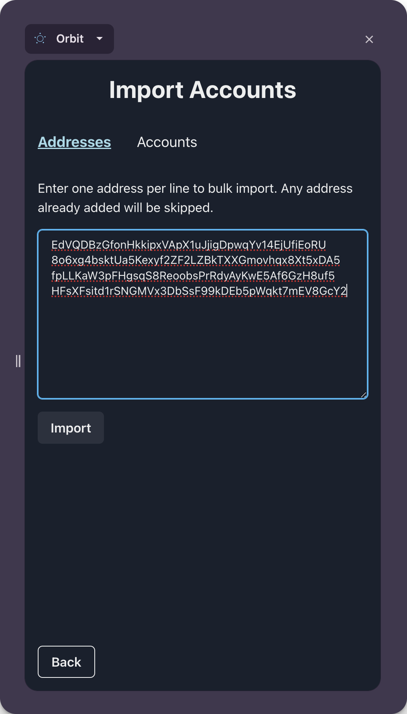

# Orbit

[Available free in the Chrome Web Store](https://chromewebstore.google.com/detail/orbit/amnodpohcllgfbhgoephohmhlfgichfa)

Orbit is a Chrome extension for organising Solana wallets. It allows adding arbitrary tags and freeform notes to each account, in addition to a label.

    
    

## Filtering

Accounts can be filtered by tags, and searched by label/notes. These can be used independently or combined.

    
    

## Connecting to an app

Orbit implements [Wallet Standard for Solana](https://github.com/anza-xyz/wallet-standard), meaning that it can be used to connect any of your accounts to any Solana app. It does not have any ability to sign for an account, so such connections are read-only.

## Exporting

### Export addresses

You can copy a list of addresses, which can be useful to bulk import into apps. Tags and search can be used to filter the addresses included.

### Export Orbit accounts

You can also export the Orbit accounts including label, notes and tags in JSON format. 

## Importing

### Import addresses

You can bulk import a list of addresses into Orbit. Addresses already stored will be skipped. Imported addresses will be given an autogenerated label and empty notes/tags.

### Import Orbit accounts

This is used to import accounts that were exported using Orbit.

## Development

Orbit is open source and built using [Vite](https://vitejs.dev/) and [wxt](https://wxt.dev).

All data is stored locally in extension storage.

The UI is built using [react-router](https://reactrouter.com/en/main).

### Running locally

The extension can be created by running `npm run dev`. This will build the extension in development mode, and open a browser with it installed. This will also watch the local repo for changes to the code and automatically update the installed extension.

### Wallet Adapter and Wallet Standard

As mentioned above, Orbit implements Wallet Standard, which means that it can be used to connect to any app without any code changes. In practice the implementation for this is going to be through [Wallet Adapter](https://github.com/anza-xyz/wallet-adapter), a library apps use to interact with Solana wallets. Currently wallet-adapter only displays wallet-standard wallets if they implement either `SolanaSignAndSendTransactionFeature` or `SolanaSignTransactionFeature` ([source](https://github.com/anza-xyz/wallet-adapter/blob/a8e4bdee26b4e4d1dd6b321999eb57c8516d775a/packages/core/base/src/standard.ts#L19)). Therefore, for now Orbit implements the `SolanaSignTransactionFeature` feature but throws an error if it is called.

## Building for production

Run `npm run build` to create a production build.

After this, just zip the `.output/chrome-mv3` directory and submit to the Chrome store!

Also see [publishing docs on wxt](https://wxt.dev/guide/publishing.html) for automation.